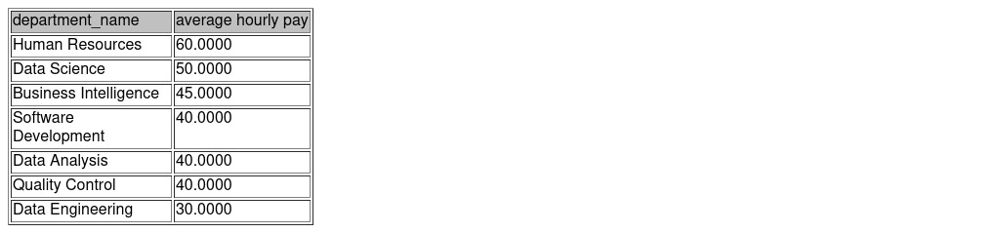

# Payroll system analysis SQL 
 
 Analyzing employees' salaries based on different criteria. Creating views to report results.  

## Skills applied

SQL, Importing data, Summarizing data, Creating views, Joining data 


## Features

- joining data 
- importing data
- grouping
- filtering


## Code

``` sql
-- Finding the average hourly pay per department 
     CREATE view department_hourly_pay AS
     SELECT Department.department_name, AVG(salary.hourly_pay) AS 'average hourly pay'
     FROM department 
     JOIN Employee
     ON Employee.Department_id = Department.Department_Id
     JOIN AccountDetails
     ON AccountDetails.Employee_Id = Employee.Employee_Id
     JOIN salary 
     ON AccountDetails.Account_Id = Salary.Account_Id
     GROUP BY Department.Department_Id
     ORDER BY 2 DESC; 

```
## Screenshots


